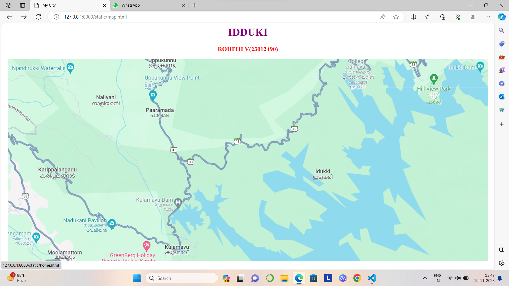
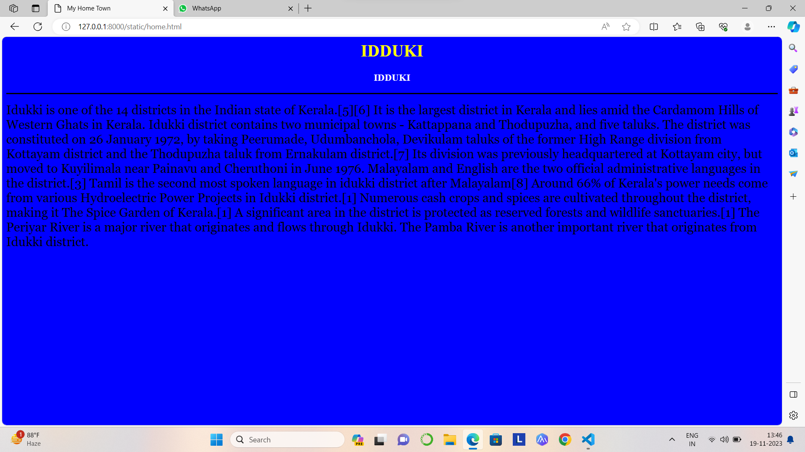
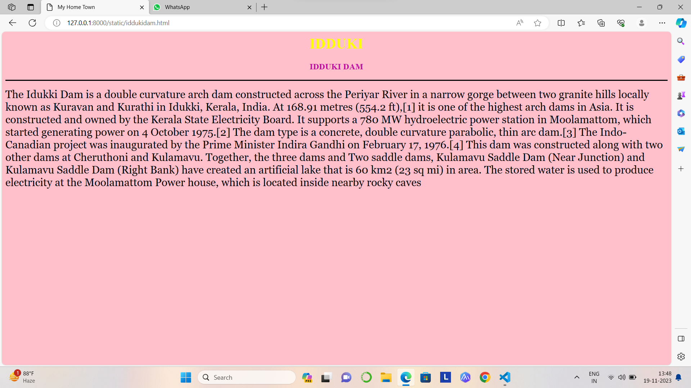
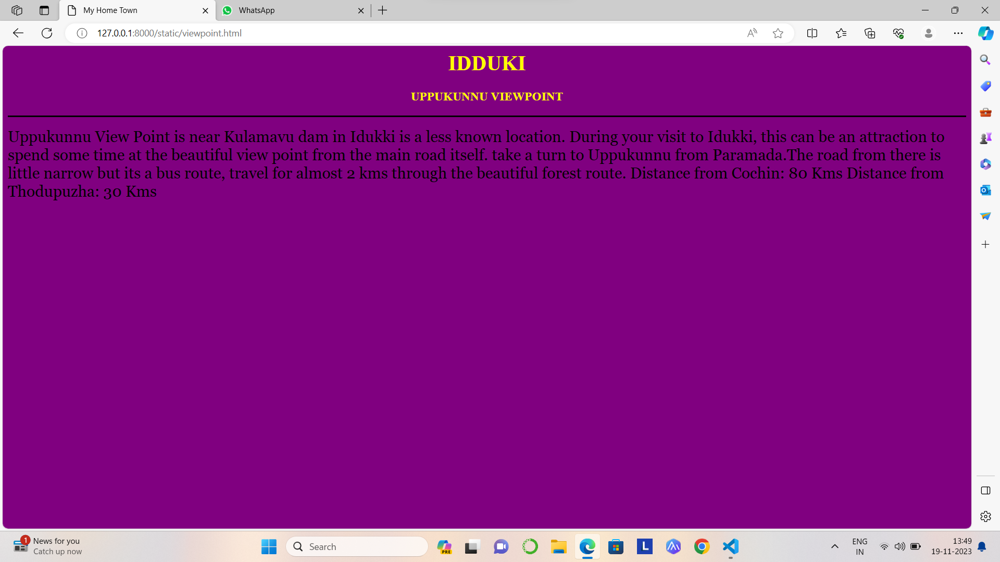
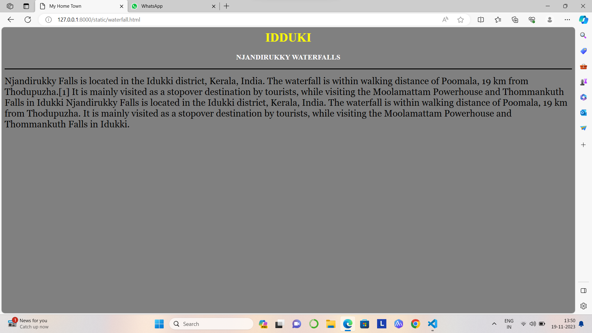
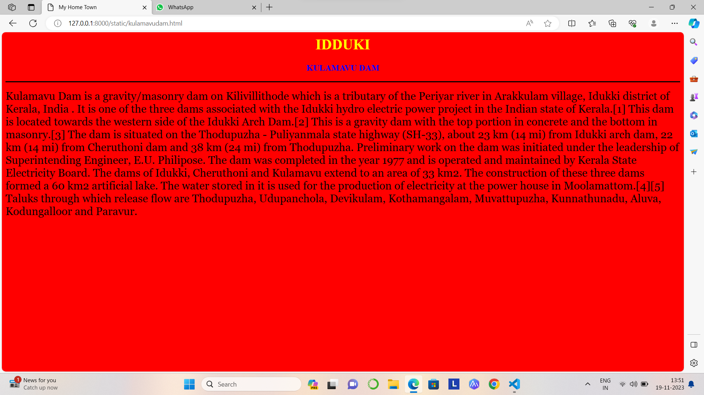

# Ex04 Places Around Me
## Date: 19/11/2023

## AIM
To develop a website to display details about the places around my house.

## DESIGN STEPS

### STEP 1
Create a Django admin interface.

### STEP 2
Download your city map from Google.

### STEP 3
Using ```<map>``` tag name the map.

### STEP 4
Create clickable regions in the image using ```<area>``` tag.

### STEP 5
Write HTML programs for all the regions identified.

### STEP 6
Execute the programs and publish them.

## CODE
map.html
<html>
<head>
<title>My City</title>
</head>
<body>
<h1 align="center">
<font color="purple"><b>IDDUKI</b></font>
</h1>
<h3 align="center">
<font color="red"><b>ROHITH V(23012490)</b></font>
</h3>
<center>

<map name="MyCity">
<area shape="circle" coords= "1000,420,100" href="home.html" title="My Home Town">
<area shape="circle" coords= "420,40,100" href="viewpoint.html" title="viewpoint">
<area shape="circle" coords= "1250,40,100" href="iddukidam.html" title="iddukidam">
<area shape="circle" coords= "150,50,40" href="waterfall.html" title="waterfall">
<area shape="circle" coords= "400,380,100" href="kulamavudam.html" title="kulamavudam">

</map>
</center>
</body>
</html>

kulamavudam.html
<html>
    <head>
        <title>My Home Town</title>
    </head>
<body bgcolor="red">
<h1 align="center">
    <font color="yellow"><b>IDDUKI</b></font>
</h1>
   <h3 align="center">
    <font color="blue"><b>KULAMAVU DAM</b></font>
   </h3>
<hr color="black" size="3">
<p align=""justify">
<font face="Georgia" size="5">
    Kulamavu Dam is a gravity/masonry dam on Kilivillithode which is a tributary of the Periyar river in Arakkulam village, Idukki district of Kerala, India . It is one of the three dams associated with the Idukki hydro electric power project in the Indian state of Kerala.[1] This dam is located towards the western side of the Idukki Arch Dam.[2] This is a gravity dam with the top portion in concrete and the bottom in masonry.[3]

The dam is situated on the Thodupuzha - Puliyanmala state highway (SH-33), about 23 km (14 mi) from Idukki arch dam, 22 km (14 mi) from Cheruthoni dam and 38 km (24 mi) from Thodupuzha. Preliminary work on the dam was initiated under the leadership of Superintending Engineer, E.U. Philipose. The dam was completed in the year 1977 and is operated and maintained by Kerala State Electricity Board.

The dams of Idukki, Cheruthoni and Kulamavu extend to an area of 33 km2. The construction of these three dams formed a 60 km2 artificial lake. The water stored in it is used for the production of electricity at the power house in Moolamattom.[4][5] Taluks through which release flow are Thodupuzha, Udupanchola, Devikulam, Kothamangalam, Muvattupuzha, Kunnathunadu, Aluva, Kodungalloor and Paravur.

</font></p>
</body>
</html>

idukidam.html
<html>
    <head>
        <title>My Home Town</title>
    </head>
<body bgcolor="pink">
<h1 align="center">
    <font color="yellow"><b>IDDUKI</b></font>
</h1>
   <h3 align="center">
    <font color="charcoal"><b>IDDUKI DAM</b></font>
   </h3>
<hr color="black" size="3">
<p align=""justify">
<font face="Georgia" size="5">
    The Idukki Dam is a double curvature arch dam constructed across the Periyar River in a narrow gorge between two granite hills locally known as Kuravan and Kurathi in Idukki, Kerala, India. At 168.91 metres (554.2 ft),[1] it is one of the highest arch dams in Asia. It is constructed and owned by the Kerala State Electricity Board. It supports a 780 MW hydroelectric power station in Moolamattom, which started generating power on 4 October 1975.[2] The dam type is a concrete, double curvature parabolic, thin arc dam.[3] The Indo-Canadian project was inaugurated by the Prime Minister Indira Gandhi on February 17, 1976.[4]

    This dam was constructed along with two other dams at Cheruthoni and Kulamavu. Together, the three dams and Two saddle dams, Kulamavu Saddle Dam (Near Junction) and Kulamavu Saddle Dam (Right Bank) have created an artificial lake that is 60 km2 (23 sq mi) in area. The stored water is used to produce electricity at the Moolamattom Power house, which is located inside nearby rocky caves

</font></p>
</body>
</html>

viewpoint.html
<html>
    <head>
        <title>My Home Town</title>
    </head>
<body bgcolor="purple">
<h1 align="center">
    <font color="yellow"><b>IDDUKI</b></font>
</h1>
   <h3 align="center">
    <font color="yellow"><b>UPPUKUNNU VIEWPOINT</b></font>
   </h3>
<hr color="black" size="3">
<p align=""justify">
<font face="Georgia" size="5">
    Uppukunnu View Point is near Kulamavu dam in Idukki is a less known location. During your visit to Idukki, this can be an attraction to spend some time at the beautiful view point from the main road itself.
take a turn to Uppukunnu from Paramada.The road from there is little narrow but its a bus route, travel for almost 2 kms through the beautiful forest route.
Distance from  Cochin: 80 Kms
Distance from Thodupuzha: 30 Kms 
  
</font></p>
</body>
</html>

waterfall.html
<html>
    <head>
        <title>My Home Town</title>
    </head>
<body bgcolor="grey">
<h1 align="center">
    <font color="yellow"><b>IDDUKI</b></font>
</h1>
   <h3 align="center">
    <font color="white"><b>NJANDIRUKKY WATERFALLS</b></font>
   </h3>
<hr color="black" size="3">
<p align=""justify">
<font face="Georgia" size="5">
    Njandirukky Falls is located in the Idukki district, Kerala, India. The waterfall is within walking distance of Poomala, 19 km from Thodupuzha.[1] It is mainly visited as a stopover destination by tourists, while visiting the Moolamattam Powerhouse and Thommankuth Falls in Idukki
    Njandirukky Falls is located in the Idukki district, Kerala, India. The waterfall is within walking distance of Poomala, 19 km from Thodupuzha. It is mainly visited as a stopover destination by tourists, while visiting the Moolamattam Powerhouse and Thommankuth Falls in Idukki.

</font></p>
</body>
</html>

home.html
<html>
    <head>
        <title>My Home Town</title>
    </head>
<body bgcolor="blue">
<h1 align="center">
    <font color="yellow"><b>IDDUKI</b></font>
</h1>
   <h3 align="center">
    <font color="white"><b>IDDUKI</b></font>
   </h3>
<hr color="black" size="3">
<p align=""justify">
<font face="Georgia" size="5">
    Idukki  is one of the 14 districts in the Indian state of Kerala.[5][6] It is the largest district in Kerala and lies amid the Cardamom Hills of Western Ghats in Kerala. Idukki district contains two municipal towns - Kattappana and Thodupuzha, and five taluks.

    The district was constituted on 26 January 1972, by taking Peerumade, Udumbanchola, Devikulam taluks of the former High Range division from Kottayam district and the Thodupuzha taluk from Ernakulam district.[7] Its division was previously headquartered at Kottayam city, but moved to Kuyilimala near Painavu and Cheruthoni in June 1976. Malayalam and English are the two official administrative languages in the district.[3] Tamil is the second most spoken language in idukki district after Malayalam[8]
    
    Around 66% of Kerala's power needs come from various Hydroelectric Power Projects in Idukki district.[1] Numerous cash crops and spices are cultivated throughout the district, making it The Spice Garden of Kerala.[1] A significant area in the district is protected as reserved forests and wildlife sanctuaries.[1] The Periyar River is a major river that originates and flows through Idukki. The Pamba River is another important river that originates from Idukki district.
</font></p>
</body>
</html>

## OUTPUT







## RESULT
The program for implementing image maps using HTML is executed successfully.
